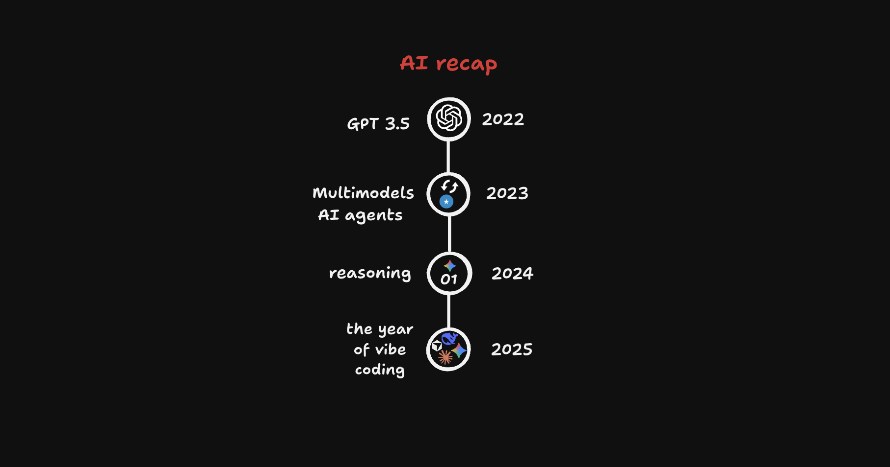

<blockquote class="tiktok-embed" cite="https://www.tiktok.com/@abdinajibmohamed12/video/7609347245212814613" data-video-id="7609347245212814613" style="max-width: 605px;min-width: 325px;" > <section> <a target="_blank" title="@abdinajibmohamed12" href="https://www.tiktok.com/@abdinajibmohamed12?refer=embed">@abdinajibmohamed12</a> </section> </blockquote> 

## 2022 – 𝗔𝗵𝗮 𝗠𝗼𝗺𝗲𝗻𝘁

Qarnigaan AI hormarka ugu weyn ee laga gaaray waxaa dhihi karnaa 2022, ee eheed markii company yar oo la dhaho OpenAI sii daayeen GPT-3.5. ChatGPT 100M oo users uu 1 bil gudaheeda ku helay, dadkii dhana weey la yaabeen awoodiisa, sababtoo ah 2022 ka hor AI hadee dadka maqlaan robot lee ku soo dhici jiray, badanaane AI ma soo dhaafi jirin research labs-ka.

## 2023 – 𝗠𝘂𝗹𝘁𝗶𝗺𝗼𝗱𝗲𝗹𝘀 𝗮𝗻𝗱 𝗔𝗜 𝗔𝗴𝗲𝗻𝘁𝘀  

Waxaa bilaawday AI inuu qoraal bis generate gareenin, ee uu sawiro iyo videos lagu sameyn karo. kadib hadane AI in uu u baahnin maanta dhan inaa adi amartid, halmar aa shaqo udiree asaa shaqada plane-gareesanaayo, Tasks uu sameesanaa tasks ilaa uu ka xaliyo loop kaas uu ku jiraa. 

Also, waxaa xusid mudan ka hor 2023 ChatGPT Somalia kuma isticmaali karin, OpenAI policy-gooda wadamada ee wax ka badaleen, Somaliana wey u ogolaadeen, waxaana kaalin fiican ka qaatay Munira Thanks.

## 2024 – 𝗥𝗲𝗮𝘀𝗼𝗻𝗶𝗻𝗴  

LLMs marka su’aal weydiisid waxee predict gareenayeen next token, and then jawaabta ee kuu soo celinayeen.

O1 model-kii ugu horeeyay ee reasoning lahaay. 
Instead oo model-ka jawaabta toos kuugu soo celin lahaay, waxuu is weydiinaayaa inee saxantahay iyo inkale, kadib wuu ku noqonaa ilaa uu is dhaho, "Jawaabta saxde eh sidaan waaye"
Hada by default model walbo reasoning uu leeyahay.

## 2025 – 𝗧𝗵𝗲 𝗬𝗲𝗮𝗿 𝗼𝗳 𝗩𝗶𝗯𝗲 𝗖𝗼𝗱𝗶𝗻𝗴

Sanadkaan wuxuu ahaay waali. Bilawga sanadka company yar oo Chinese ah oo la dhaho DeepSeek aa waxee release gareeyeen model la dhaho DeepSeek R1, kadib US tech stock waxuu down noqday $1 trillion.

Qof walbo oo AI ka shakisanay inuu code qori karin, I mean quality code, 2025 wuu shaki baxay. Company-yaasha AI models sameeyo waxee also isku dayayeen inee developers-ka hantaan waxee sameyeen tools badan lkn waxaa ubadnaa CLI tools.

- Claude Code
- Codex
- Gemini CLI

Sanadkaan sanad waali ayuu ahaay, gaar ahaan programming iyo agentic coding-ka.
