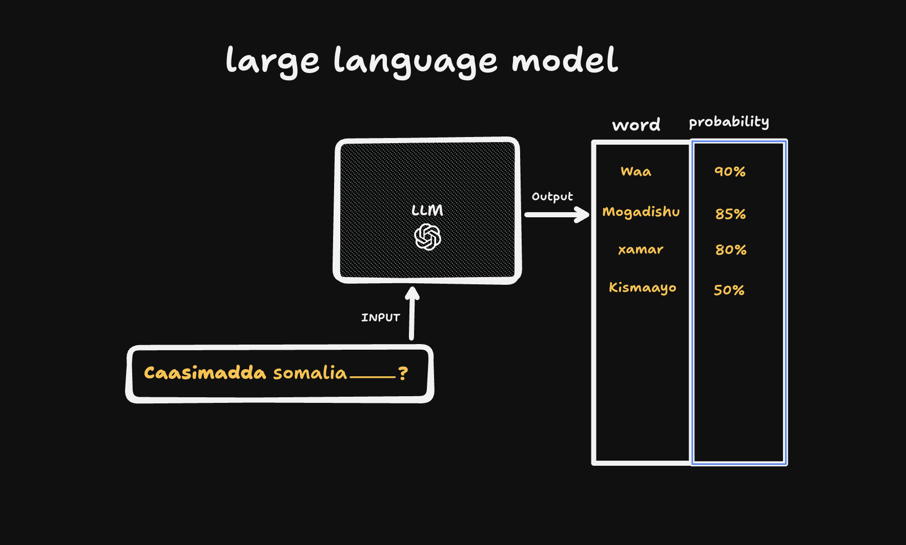

𝗛𝗮𝗱𝗮𝗮 𝗿𝗮𝗯𝘁𝗶𝗱 𝗶𝗻𝗮𝗮 𝗸𝗮 𝗳𝗶𝗶𝗰𝗻𝗮𝗮𝘁𝗶𝗱 𝗮𝘃𝗲𝗿𝗮𝗴𝗲 𝗔𝗜 𝘂𝘀𝗲𝗿 𝗮𝗺𝗮 𝗾𝗼𝗳 𝗰𝗮𝗮𝗱𝗶 𝗲𝗵 𝗼𝗼 𝗖𝗵𝗮𝘁𝗚𝗣𝗧 𝗰𝗮𝗮𝗱𝗶 𝘄𝗮𝘅 𝘂 𝘄𝗲𝗲𝘆𝗱𝗶𝗶𝘆𝗼, 𝗾𝗼𝗿𝗮𝗮𝗹𝗸𝗮𝗮𝗻 𝗮𝗾𝗿𝗶𝘀𝗼.

ChatGPT iyo AI-yada lamidka eh waxaa la dhahaa Large Language Models (LLMs).

## 𝗦𝗶 𝗳𝘂𝗱𝘂𝗱 𝘀𝗶𝗱𝗲𝗲 𝘂𝘀𝗵𝗮𝗾𝗲𝗲𝘆𝗮𝗮𝗻?

LLMs-ka waxa lee sameeyaan, markaa qoraal uqortid, waxee qiyasayaan ereyadaan laguu sooqoray maxaa ku xigi jiray caadiyaan.

**Tusaale:** Hadaa AI uqortid:

> "𝗰𝗮𝗮𝘀𝗶𝗺𝗮𝗱𝗮 𝘀𝗼𝗺𝗮𝗹𝗶𝗮 𝗺𝗮𝗴𝗮𝗰𝗲𝗲𝗱 "

AI-ga waxuu heestaa data badan oo lagu tababaray, badana waxaa kala dageen internetka. Waxuu sameenaa list oo ereyo eh uu ka soo dhex helay datadii lagu traingareeyay.

Tusaale ahaan, gudaha modelka waxuu ka fiirinaa sidaan oo kale (tani waa inuu isagaa ku jirto maskaxdiisa, adiga ma arkeysid):

- Caasimada somaliya **___**
  - waa [80%]
  - Mogadishu [75%]
  - xamar [65%]
  - kismaayo [50%]

Ereyadaan probability bay wataan, oo ah fursad ay sax ku noqon karaan. Tusaalaha kore, datada modelka lagu tababaray waxaa badanaa ku xigeysay "caasimada somalia" ereyga **"waa"**. Sababtoo ah dadka badanaa "caasimada Somalia Mogadishu" maqoraan; af-Soomaali natural ah ma'ahan. Statistically midka udhow aa qiyaasoonaa, so "waa" buu qaataa:

> Caasimada somaliya **waa** ___

Markaas waxaa markale loo gelinaa AI-ga, hadane wuu qiyaasaa ereyga ku xiga:

- Caasimada somaliya waa **___**
  - Mogadishu [90%]
  - xamar [60%]
  - kismaayo [50%]

Markaas ayuu dhahaa:

> Caasimada somaliya waa Mogadishu.

Uma baahnid inaa ML engineer noqotid si aad u fahamtid. Marka LLM maqashid, maskaxda ha kaaga soo dhacdo: **waxaa lee qiyaasaa ereygaan ereyga ku xigo**, maaha iney sida bani-aadamka jumlad dhameestiran u akhrinayaan oo fahmayaan.

## 𝗧𝗼𝗸𝗲𝗻𝘀

Kor waxaan aad u isticmaalayay ereyga "erey", markaan sharxaayey LLMs; lkn sida saxda ah waxaa la dhahaa **token**.

Token waxaa waaye: markee LLM-yadu qiyaasta sameynayaan, qoraalka waxee u jajibiyaan qaybo yaryar oo la dhaho tokens. Token mararka qaarkood waa ka weynaan karaa erey, mararka qaar ka yaraan karaa. 

Hadaa rabtid inaad aragtid ChatGPT tokenization suu u sameeyo, ka fiiri:

- <a href="https://platform.openai.com/tokenizer" style="color: #00ccff; text-decoration: none;">https://platform.openai.com/tokenizer</a>

Halkaas waxaad ku arkeysaa qoraal kasta in tokens loo kala jabinayo.

## 𝗖𝗼𝗻𝘁𝗲𝘅𝘁 𝘄𝗶𝗻𝗱𝗼𝘄

LLMs waxaa jiro meel ay ku egtahay **xasuustooda (context window)**.

Tusaale: ChatGPT aa la sheekeesaneyso cabaar, hal window aa kuu furnaay, waxaad is leedahay: "wixii hore oo dhan wuu xasuustaa." 

Laakiin waxaa jiro xad uu ku egyahay xasuusta modelka. Tusaale, GPT-5 hadaa leeyahay 1-million tokens context, ka badan ma xasuusnaan karo hal mar. Haduu qoraalkaagu ka bato, kuwii ugu horreeyay ayaa ka harhaya xasuusta.

So mar walbo aa mowduuc cusub kala hadli rabtid, tab ama window cusub furo. Waxaad kaloo ogaatid in ChatGPT **uusan run ahaantii "xusuus joogto ah" lahayn**, ee uu kaliya eegayo tokens-ka hadda la siiyay (plus wixii aan xadkiisa ka bixin).
