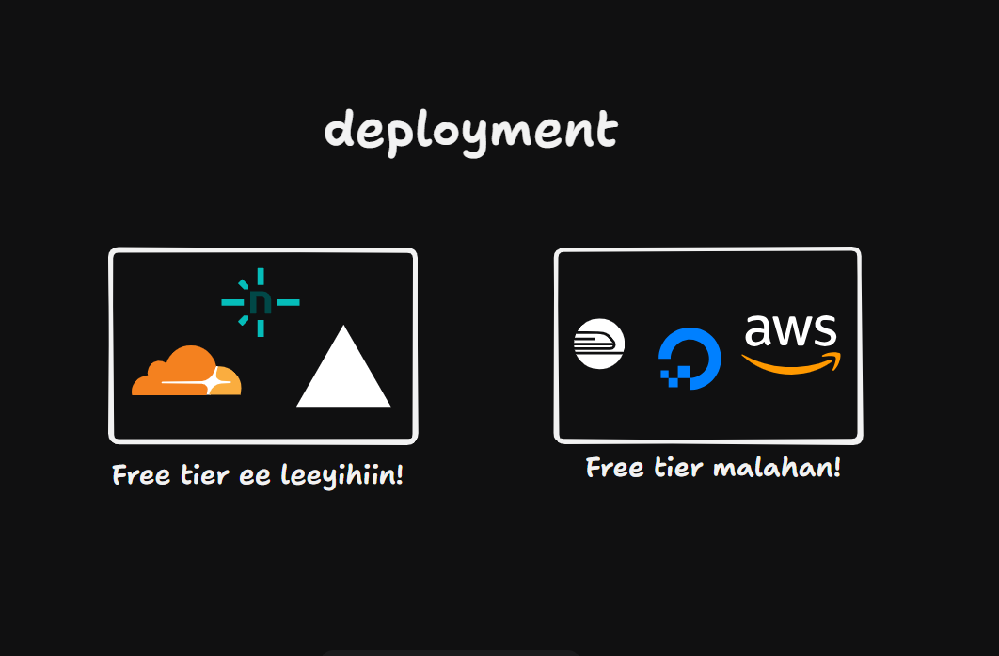

Saa u faham sheekadaan, waxyar gadaal aa u noqono.

2010, hadaad rabtid inaad application sameysid, waxee eheed straight forward.
Waxaa badanaa la isticmaali jiray LAMP stack (L = Linux, A = Apache, M = MySQL, P = PHP). Markaa deployment-iga easy uu ahaay VPS (Virtual Private Server) baa kireysaneysaa, then server-kaaga aa daranee, kadib code-kaaga dhax dhigee.

Dhibka meeshaan jiro waxaa waaye VPS-ka daaran adaa iska leh, adigoo kaa ijaaranyahay. Haduu yahay 4GB RAM, 2 Core CPU, this means adaa iska leh. Haduu traffic-ga ka bato nasiibkaa, 
1,000,000 user ama 1 user heyso adee ku talaa lacagtaas walagaa rabaa. Haduu traffic bato auto scaling ma lahan, usero qaar error arki doonaan. Tusaale <a href="https://soneb.gov.so/natiijada_ardayga_list.php" style="color: #00ccff; text-decoration: none;">wasarada waxbarashada somalia</a> markee imtixaanka dowlada result-igiisa ee soo deyneyso, traffic badan uu website-ka helaa, and then usero qaar ma isticmaali karaan error ee arkaan because serverkooda maxamili karo trafficgaas.

Dhinaca kale, serverless waxaa waaye instead aa heysan laheed VPS oo 24 hours kuu daaranaa lahaa, waxaa la sameenaa code-kaaga dhan waxaa la gelinaa storage. Mar walbo oo website-kaaga la soo booqdo, waxaa la sameenaa server aa loo daraa user-kaas soo booqanooyo. Waxaa ka wadaa user walbo oo website-kaaga soo booqdo, markaas aa waxaa loo darooyaa server haduu jirin mid warm up horey u ahaay, kadib code-kii aa la run gareenaa. Markuu user-ka baxo-ne, waxyar uu sii daarnaanaa server-ka, haduu user kale soo booqan waay waala daminaa serverkaas.
 
Vercel mar walbo aa wax ku deploy gareesid, waxee sameenayaan code-kaaga ee S3 bucket ku ridayaan. Server daran ma jiro. Markii uu qof soo booqdo aa server aa loo spin gareenaa. Markaas waxaa fudud hadaad 1,000,000 user ee ku soo booqdaan adoo ogeen automaticly scaling aa heestaa, user error arkaayo ma jiro.

Vercel iyo Netlify waxee isticmaalaan AWS Lambda, physical servers ma heestaan. Dadka badanaa markee Vercel maqlaan, niyada developer experience aa ku soo dhacdo, lkn sheekada wee ka weentahay in deployment-iga la fududeeyo. Of course, serverless mostly dadka waxee dhahaan muhiimada ugu ween waxaa waaye in aadan server-kaaga ka walwalin waa sax, lkn server aa naqaane camal ma ahan.

